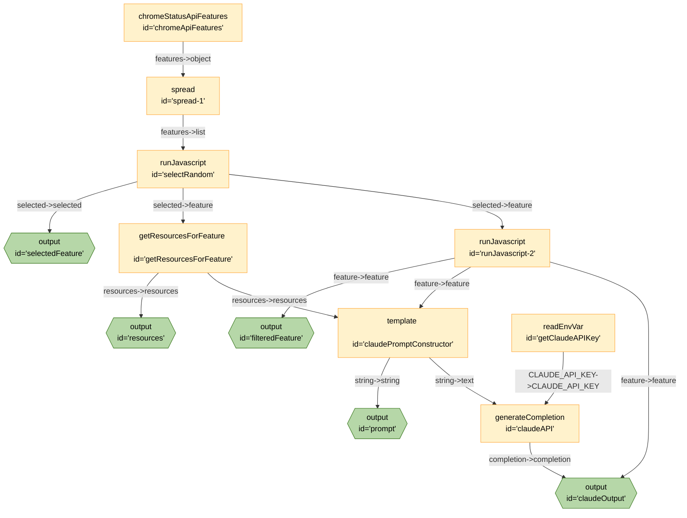

# AutoBake



```json
{
	"title": "AutoBake",
	"edges": [
		{
			"from": "chromeApiFeatures",
			"to": "spread-1",
			"out": "features",
			"in": "object"
		},
		{
			"from": "spread-1",
			"to": "selectRandom",
			"out": "features",
			"in": "list"
		},
		{
			"from": "selectRandom",
			"to": "selectedFeature",
			"out": "selected",
			"in": "selected"
		},
		{
			"from": "selectRandom",
			"to": "getResourcesForFeature",
			"out": "selected",
			"in": "feature"
		},
		{
			"from": "getResourcesForFeature",
			"to": "resources",
			"out": "resources",
			"in": "resources"
		},
		{
			"from": "selectRandom",
			"to": "runJavascript-2",
			"out": "selected",
			"in": "feature"
		},
		{
			"from": "runJavascript-2",
			"to": "filteredFeature",
			"out": "feature",
			"in": "feature"
		},
		{
			"from": "runJavascript-2",
			"to": "claudePromptConstructor",
			"out": "feature",
			"in": "feature"
		},
		{
			"from": "getResourcesForFeature",
			"to": "claudePromptConstructor",
			"out": "resources",
			"in": "resources"
		},
		{
			"from": "claudePromptConstructor",
			"to": "prompt",
			"out": "string",
			"in": "string"
		},
		{
			"from": "getClaudeAPIKey",
			"to": "claudeAPI",
			"out": "CLAUDE_API_KEY",
			"in": "CLAUDE_API_KEY"
		},
		{
			"from": "claudePromptConstructor",
			"to": "claudeAPI",
			"out": "string",
			"in": "text"
		},
		{
			"from": "runJavascript-2",
			"to": "claudeOutput",
			"out": "feature",
			"in": "feature"
		},
		{
			"from": "claudeAPI",
			"to": "claudeOutput",
			"out": "completion",
			"in": "completion"
		}
	],
	"nodes": [
		{
			"id": "chromeApiFeatures",
			"type": "chromeStatusApiFeatures"
		},
		{
			"id": "claudeAPI",
			"type": "generateCompletion",
			"configuration": {
				"model": "claude-2",
				"url": "https://api.anthropic.com/v1/complete"
			}
		},
		{
			"id": "claudePromptConstructor",
			"type": "template",
			"configuration": {
				"template": "Create a markdown document that can be used to teach a junior developer about the feature discussed in the `feature` code block./nBase the script on the content of the `resources` code block./nThe first line of the document should be a heading with the name of the feature./n\n/nProvide your response formatted as raw markdown./nOnly respond with the result of this request./nDo not add any additional information to the script/n\n/n```resources/n{{resources}}/n```/n\n/n```feature/n{{feature}}/n```"
			}
		},
		{
			"id": "getClaudeAPIKey",
			"type": "readEnvVar",
			"configuration": {
				"key": "CLAUDE_API_KEY"
			}
		},
		{
			"id": "selectRandom",
			"type": "runJavascript",
			"configuration": {
				"raw": true,
				"code": "function run({list}){const selected=list[Math.floor(Math.random()*list.length)];return{id:selected.id,selected,list}}"
			}
		},
		{
			"id": "spread-1",
			"type": "spread"
		},
		{
			"id": "selectedFeature",
			"type": "output"
		},
		{
			"id": "getResourcesForFeature",
			"type": "getResourcesForFeature"
		},
		{
			"id": "resources",
			"type": "output"
		},
		{
			"id": "runJavascript-2",
			"type": "runJavascript",
			"configuration": {
				"name": "filterAttributes",
				"code": "function filterAttributes(obj){if(!obj){return}else if(typeof obj===\"object\"){const newObj={};for(const[key,value]of Object.entries(obj)){const newValue=filterAttributes(value);if(newValue){newObj[key]=newValue}}if(Object.keys(newObj).length>0){return newObj}else{return}}else if(Array.isArray(obj)){const newArray=[];for(const value of obj){const newValue=filterAttributes(value);if(newValue){newArray.push(newValue)}}return newArray}return obj}",
				"raw": true
			}
		},
		{
			"id": "filteredFeature",
			"type": "output"
		},
		{
			"id": "prompt",
			"type": "output"
		},
		{
			"id": "claudeOutput",
			"type": "output"
		}
	],
	"kits": [
		{
			"url": "npm@exadev/breadboard-kits/featureKit"
		},
		{
			"url": "npm:@exadev/breadboard-kits/Claude"
		},
		{
			"url": "npm:@exadev/breadboard-kits/kits/StringKit"
		},
		{
			"url": "npm:@exadev/breadboard-kits/kits/ConfigKit"
		},
		{
			"url": "npm:@google-labs/core-kit"
		},
		{
			"url": "npm:@exadev/breadboard-kits/kits/ObjectKit"
		}
	]
}
```