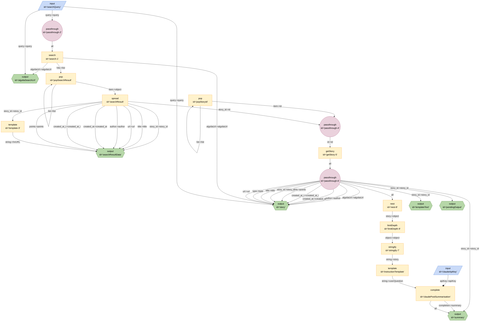

# DevPulse



```json
{
	"title": "DevPulse",
	"edges": [
		{
			"from": "searchQuery",
			"to": "passthrough-2",
			"out": "query",
			"in": "query"
		},
		{
			"from": "passthrough-2",
			"to": "search-1",
			"out": "*"
		},
		{
			"from": "search-1",
			"to": "algoliaSearchUrl",
			"out": "algoliaUrl",
			"in": "algoliaUrl"
		},
		{
			"from": "searchQuery",
			"to": "algoliaSearchUrl",
			"out": "query",
			"in": "query"
		},
		{
			"from": "search-1",
			"to": "popSearchResult",
			"out": "hits",
			"in": "list"
		},
		{
			"from": "popSearchResult",
			"to": "popSearchResult",
			"out": "list",
			"in": "list"
		},
		{
			"from": "popSearchResult",
			"to": "searchResult",
			"out": "item",
			"in": "object"
		},
		{
			"from": "searchResult",
			"to": "searchResultData",
			"out": "story_id",
			"in": "story_id"
		},
		{
			"from": "searchResult",
			"to": "searchResultData",
			"out": "title",
			"in": "title"
		},
		{
			"from": "searchResult",
			"to": "searchResultData",
			"out": "url",
			"in": "url"
		},
		{
			"from": "searchResult",
			"to": "searchResultData",
			"out": "author",
			"in": "author"
		},
		{
			"from": "searchResult",
			"to": "searchResultData",
			"out": "created_at",
			"in": "created_at"
		},
		{
			"from": "searchResult",
			"to": "searchResultData",
			"out": "created_at_i",
			"in": "created_at_i"
		},
		{
			"from": "searchResult",
			"to": "searchResultData",
			"out": "points",
			"in": "points"
		},
		{
			"from": "template-3",
			"to": "searchResultData",
			"out": "string",
			"in": "hnURL"
		},
		{
			"from": "searchResult",
			"to": "template-3",
			"out": "story_id",
			"in": "story_id"
		},
		{
			"from": "popStoryId",
			"to": "popStoryId",
			"out": "list",
			"in": "list"
		},
		{
			"from": "popStoryId",
			"to": "passthrough-4",
			"out": "item",
			"in": "id"
		},
		{
			"from": "searchResult",
			"to": "passthrough-4",
			"out": "story_id",
			"in": "id"
		},
		{
			"from": "passthrough-4",
			"to": "getStory-5",
			"out": "id",
			"in": "id"
		},
		{
			"from": "getStory-5",
			"to": "passthrough-6",
			"out": "*"
		},
		{
			"from": "passthrough-6",
			"to": "story",
			"out": "algoliaUrl",
			"in": "algoliaUrl"
		},
		{
			"from": "passthrough-6",
			"to": "story",
			"out": "author",
			"in": "author"
		},
		{
			"from": "passthrough-6",
			"to": "story",
			"out": "created_at",
			"in": "created_at"
		},
		{
			"from": "passthrough-6",
			"to": "story",
			"out": "created_at_i",
			"in": "created_at_i"
		},
		{
			"from": "passthrough-6",
			"to": "story",
			"out": "points",
			"in": "points"
		},
		{
			"from": "passthrough-6",
			"to": "story",
			"out": "story_id",
			"in": "story_id"
		},
		{
			"from": "passthrough-6",
			"to": "story",
			"out": "title",
			"in": "title"
		},
		{
			"from": "passthrough-6",
			"to": "story",
			"out": "type",
			"in": "type"
		},
		{
			"from": "passthrough-6",
			"to": "story",
			"out": "url",
			"in": "url"
		},
		{
			"from": "search-1",
			"to": "story",
			"out": "algoliaUrl",
			"in": "algoliaUrl"
		},
		{
			"from": "searchQuery",
			"to": "story",
			"out": "query",
			"in": "query"
		},
		{
			"from": "passthrough-6",
			"to": "nest-8",
			"out": "*"
		},
		{
			"from": "nest-8",
			"to": "limitDepth-9",
			"out": "story",
			"in": "object"
		},
		{
			"from": "limitDepth-9",
			"to": "stringify-7",
			"out": "object",
			"in": "object"
		},
		{
			"from": "passthrough-6",
			"to": "templateText",
			"out": "story_id",
			"in": "story_id"
		},
		{
			"from": "stringify-7",
			"to": "instructionTemplate",
			"out": "string",
			"in": "story"
		},
		{
			"from": "passthrough-6",
			"to": "pendingOutput",
			"out": "story_id",
			"in": "story_id"
		},
		{
			"from": "claudeApiKey",
			"to": "claudePostSummarisation",
			"constant": true,
			"out": "apiKey",
			"in": "apiKey"
		},
		{
			"from": "instructionTemplate",
			"to": "claudePostSummarisation",
			"out": "string",
			"in": "userQuestion"
		},
		{
			"from": "passthrough-6",
			"to": "summary",
			"out": "story_id",
			"in": "story_id"
		},
		{
			"from": "claudePostSummarisation",
			"to": "summary",
			"out": "completion",
			"in": "summary"
		},
		{
			"from": "claudePostSummarisation",
			"to": "summary",
			"out": "*"
		}
	],
	"nodes": [
		{
			"id": "searchQuery",
			"type": "input",
			"configuration": {
				"schema": {
					"type": "object",
					"properties": {
						"searchQuery": {
							"type": "string",
							"title": "searchQuery"
						}
					}
				}
			}
		},
		{
			"id": "search-1",
			"type": "search",
			"configuration": {
				"tags": [
					"story"
				],
				"limit": 2
			}
		},
		{
			"id": "passthrough-2",
			"type": "passthrough"
		},
		{
			"id": "algoliaSearchUrl",
			"type": "output"
		},
		{
			"id": "popSearchResult",
			"type": "pop"
		},
		{
			"id": "searchResult",
			"type": "spread"
		},
		{
			"id": "searchResultData",
			"type": "output"
		},
		{
			"id": "template-3",
			"type": "template",
			"configuration": {
				"template": "https://news.ycombinator.com/item?id={{story_id}}"
			}
		},
		{
			"id": "popStoryId",
			"type": "pop"
		},
		{
			"id": "passthrough-4",
			"type": "passthrough"
		},
		{
			"id": "getStory-5",
			"type": "getStory"
		},
		{
			"id": "passthrough-6",
			"type": "passthrough"
		},
		{
			"id": "story",
			"type": "output"
		},
		{
			"id": "claudeApiKey",
			"type": "input"
		},
		{
			"id": "stringify-7",
			"type": "stringify"
		},
		{
			"id": "nest-8",
			"type": "nest",
			"configuration": {
				"key": "story"
			}
		},
		{
			"id": "limitDepth-9",
			"type": "limitDepth",
			"configuration": {
				"depth": 3
			}
		},
		{
			"id": "templateText",
			"type": "output",
			"configuration": {
				"instruction": "Summarise the discussion regarding this post",
				"templateText": "Summarise the discussion regarding this post\n```json\n{{story}}\n```"
			}
		},
		{
			"id": "instructionTemplate",
			"type": "template",
			"configuration": {
				"template": "Summarise the discussion regarding this post\n```json\n{{story}}\n```"
			}
		},
		{
			"id": "pendingOutput",
			"type": "output",
			"configuration": {
				"summary": "pending"
			}
		},
		{
			"id": "claudePostSummarisation",
			"type": "complete",
			"configuration": {
				"model": "claude-2",
				"url": "http://localhost:5173/anthropic/v1/complete"
			}
		},
		{
			"id": "summary",
			"type": "output"
		}
	],
	"kits": [
		{
			"url": "npm:@exadev/breadboard-kits/HackerNewsFirebaseKit"
		},
		{
			"url": "npm:@exadev/breadboard-kits/HackerNewsAlgoliaKit"
		},
		{
			"url": "npm:@google-labs/core-kit"
		},
		{
			"url": "npm:@exadev/breadboard-kits/list"
		},
		{
			"url": "npm:@exadev/breadboard-kits"
		},
		{
			"url": "npm:@exadev/breadboard-kits/kits/ObjectKit"
		},
		{
			"url": "npm:@exadev/breadboard-kits/kits/StringKit"
		},
		{
			"url": "npm:@exadev/breadboard-kits/HackerNewsAlgoliaKit"
		},
		{
			"url": "npm:@exadev/breadboard-kits/kits/JsonKit"
		},
		{
			"url": "npm:@exadev/breadboard-kits/kits/ObjectKit"
		}
	]
}
```